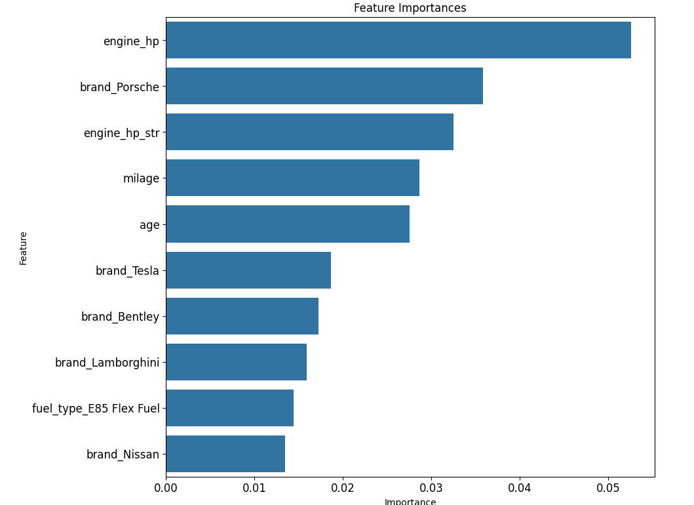

# used_cars predicting price using the XGBoost model
Used cars dataset (Kaggle) machine learning model to predict price.

The Jupyter notebook used_cars.ipynb demonstrates core data science analysis and machine learning skills. It features standard libraries: numpy, pandas, matplotlib, seaborn, and scikit-learn.

After cleaning, feature engineering, and categorical one-hot encoding, the dataframe ended up with 1931 features. Three columns had missing values that were handled in various ways. Extreme outliers (99% percentile) in milage and price were dropped. I also got better results by using the natural log of price.

With iterative trial and error, I explored basic regressions, RandomForestRegressor, and XGBRegressor models on the price. I found the best results from XGBRegressor. I proceeded to use a 
grid search to find the best hyperparameters. 

Development was done on Google CoLab and also locally on a Linux workstation. I ran more exhaustive grid searches with suggestions from OpenAI O1. The longer grid searches were run locally due to limited free resources on CoLab, but did not show significant improvements.

Models were evaluated using R-squared and mean absolute error.

**Mean Absolute Error: 7602.032509840172**

**R-squared Score: 0.821394625089001**

The notebook can still be improved by better design for handling new, outside data for predictions. Also, the engine feature could be broken into engine_hp and engine_displacement. I only used engine_hp.

