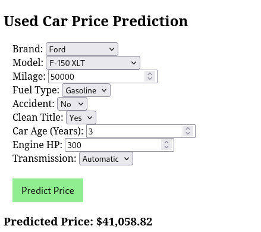
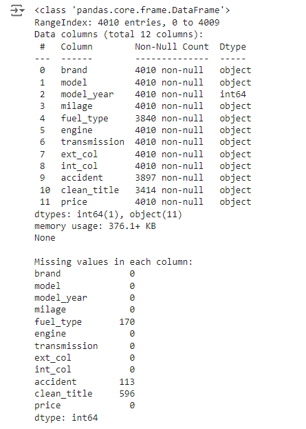
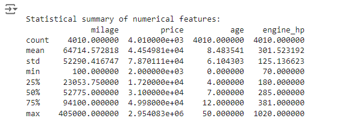
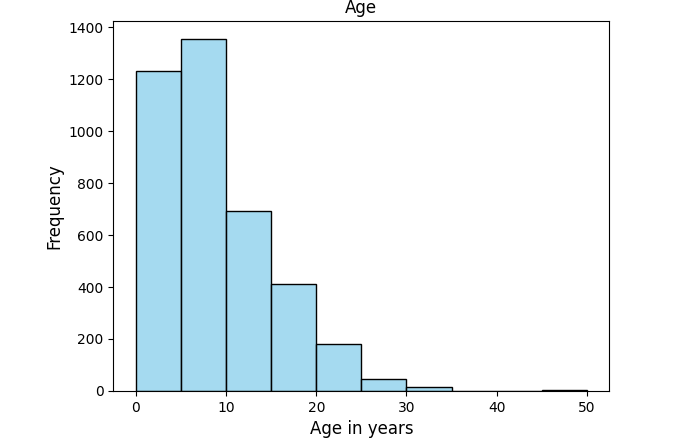
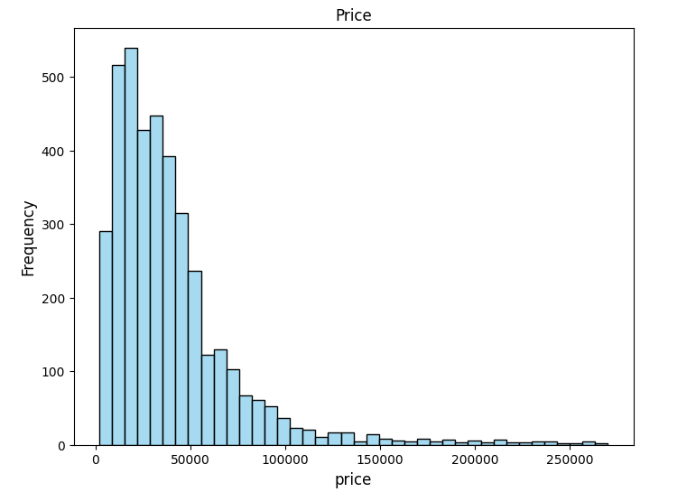
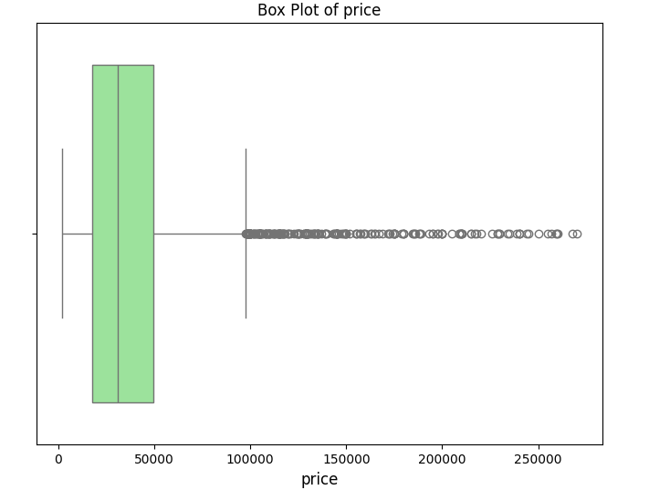
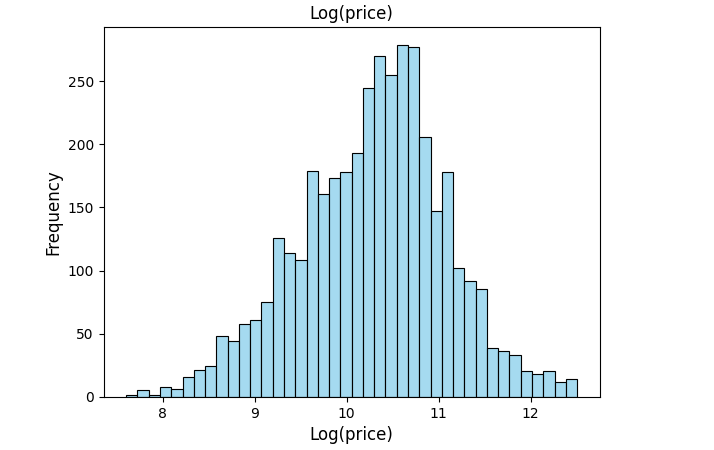

# Predicting used car prices with multiple regression
Used cars dataset (Kaggle) machine learning model to predict price.

The two notebooks demonstrate core data science analysis and machine learning skills. It features standard libraries: numpy, pandas, matplotlib, seaborn, statsmodels, and scikit-learn.

After completing the model, I saved it (360 MB pickled) and wrote a demo web app using flask to feed data to the model and get the price prediction back. The model was not saved to the repository, but it can be created by running the Jupyter notebook used_cars_multiple_regression.

During cleaning and feature engineering, I handled three columns with missing values in various ways. Extreme outliers (99% percentile) in milage and price were dropped. 
Some missing values were replaced with the feature median. I got the best results by using the natural log of price.

I experimented with three different models. First was RandomForestRegressor with categoricals one-hot encoded. It had a mid-range R-squared (0.73) and mean absolute error. 
Next, I used an XGBoost model and it performed slightly better, with a higher R-squared and lower MAE.
For each machine learning model, I used a grid search to find the best parameters. (Jupyter notebook used_cars_random_forest_regressor.ipynb)

Next, I tried multiple regression. This model had a very high adjusted R-squared and I tested regression assumptions. (Jupyter notebook used_cars_multiple_regression).

Development was done on Google CoLab and also locally on a Linux workstation. I ran more exhaustive grid searches locally due to limited free resources on CoLab, but these did not show significant improvements. 

Models were evaluated using (adjusted) R-squared and mean absolute error.

**Adjusted R-squared Score: 0.942**

